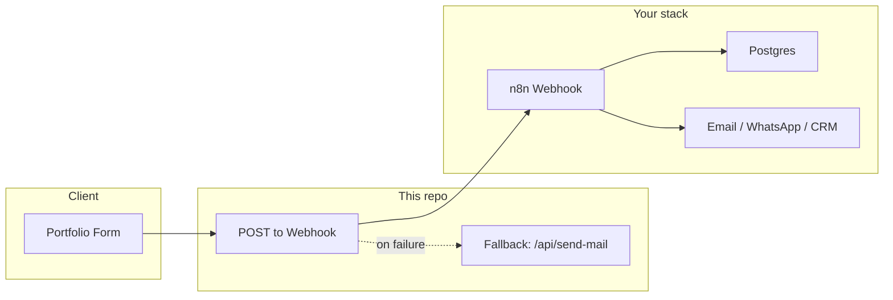
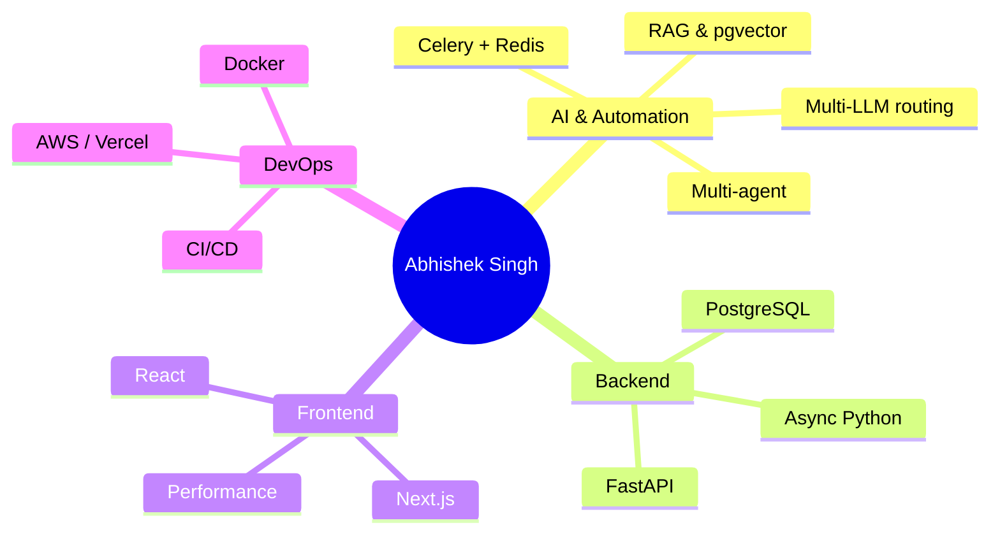

<div align="center">

  

  <br />

  # Abhishek Singh

  ## Applied AI Engineer | Multi-Agent Systems | AI Automation Architect

  I build production-grade AI systems that orchestrate multi-agent workflows, RAG pipelines, and cost-optimized LLM infrastructure.

  🚀 **Zaytri** – a live AI automation platform using multi-agent orchestration, async task queues, vector search, and dynamic LLM routing.

  <br />

  [](https://github.com/abhishekthatguy)
  [](https://abhishekthatguy.in)
  [](https://linkedin.com/in/abhishekthatguy)
  [](./LICENSE)
  
  [](https://github.com/abhishekthatguy?tab=followers)

</div>

---

## 🚀 Featured Project: Zaytri (Live AI Automation Platform)

**Architecture Highlights:**

- Master Agent Orchestrator (18+ intent actions)
- Multi-Agent Pipeline (Content, Review, Hashtag, Image, Engagement)
- Celery + Redis async task system
- Brand-aware RAG using PostgreSQL + pgvector
- Multi-LLM Router (Ollama, OpenAI, Gemini, Anthropic)
- Local-first inference for API cost optimization
- Observability dashboard & agent health tracking

🔗 **Live Demo:** [abhishekthatguy.in](https://abhishekthatguy.in)  
📄 Architecture Diagram Below

---

## 📐 Architecture Diagram





---

## 📈 Impact

- Orchestrated 18+ agent workflows in production AI system
- Achieved 90+ Lighthouse performance across major web platforms
- Reduced AI API costs using hybrid local inference architecture
- Led frontend migrations (Vue 2 → Vue 3)

---

## 🧠 Skills

### 🧠 AI & Automation

Multi-Agent Systems • RAG • Vector Search (pgvector) • Prompt Engineering • LLM Routing • Async AI Pipelines

### ⚙️ Backend Systems

FastAPI • Celery • Redis • PostgreSQL • JWT • GraphQL

### 🎨 Frontend Architecture

Next.js • React • Vue • Performance Optimization (90+ Lighthouse)

### 🚀 DevOps & Infra

Docker • CI/CD • Vercel • AWS • Nginx

---

## 📂 Other Projects

| Project | Description | Stack |
|---------|-------------|--------|
| **Portfolio (this site)** | High-performance portfolio with theme-aware UI, contact webhook, Nodemailer fallback | Next.js 14, React, Tailwind, Framer Motion, Vercel |
| **Policy Advisor** | Insurance platform — Vue.js, GraphQL, 30–90% perf gains, 20+ broker channels | Vue, Vuex, Strapi, Ruby on Rails |
| **Accredo & Express Scripts** | Healthcare UI refactor — React, 85%+ test coverage, HIPAA, zero downtime | React, Jest, Context API, LaunchDarkly |

*Full project list and metrics:* [abhishekthatguy.in#projects](https://abhishekthatguy.in#projects)

---

## 📌 Featured Repositories

<div align="center">
  <a href="https://github.com/abhishekthatguy/zaytri">
    
  </a>
  <a href="https://github.com/abhishekthatguy/luxflow-ai">
    
  </a>
  <a href="https://github.com/abhishekthatguy/clawtbot">
    
  </a>
  <a href="https://github.com/abhishekthatguy/abhishekthatguy">
    
  </a>
</div>

---

## 📊 GitHub Stats

<div align="center">
  
  
  <br />
  
</div>

---

## 🐍 Contribution Snake

<div align="center">
  <picture>
    <source media="(prefers-color-scheme: dark)" srcset="https://raw.githubusercontent.com/abhishekthatguy/abhishekthatguy/output/github-contribution-grid-snake-dark.svg" />
    <source media="(prefers-color-scheme: light)" srcset="https://raw.githubusercontent.com/abhishekthatguy/abhishekthatguy/output/github-contribution-grid-snake.svg" />
    
  </picture>
</div>

---

## 🔬 Currently Exploring

- Autonomous agent collaboration patterns
- Tool-based reasoning frameworks
- AI observability & evaluation systems
- Production LLM reliability engineering

---

## 💼 Open To

- **Applied AI Engineer** roles  
- **AI Automation Architect**  
- **AI Systems Engineer** (Product Teams)

---

## 📬 Contact

- **Portfolio:** [abhishekthatguy.in](https://abhishekthatguy.in)
- **GitHub:** [github.com/abhishekthatguy](https://github.com/abhishekthatguy)
- **LinkedIn:** [linkedin.com/in/abhishekthatguy](https://linkedin.com/in/abhishekthatguy)

---

## 📦 This Repo: Portfolio Site

This repository is the source for **[abhishekthatguy.in](https://abhishekthatguy.in)** — a performant, theme-aware portfolio built with Next.js.

### Tech Stack

| Layer | Technologies |
|-------|--------------|
| **Frontend** | Next.js 14, React 18, Tailwind CSS 3, Framer Motion 12, PostCSS |
| **Contact** | n8n webhook (URL in `.env`) → Postgres / Email / WhatsApp / CRM; fallback: Nodemailer |
| **Testing** | Jest 29, React Testing Library |
| **Lint** | ESLint, eslint-config-next |
| **Hosting** | Vercel |

### How to Start

**Requirements:** Node.js **20+** (LTS). Use `.nvmrc` / `.node-version` for nvm/fnm (`nvm use` or `fnm use`).

**Development**

```bash
yarn install
yarn dev
```

Open [http://localhost:3000](http://localhost:3000) (or the port shown).

**Build & run**

```bash
yarn build
yarn start
```

**Deploy to Vercel**

```bash
yarn deploy          # Automated (recommended)
yarn deploy:quick   # Quick prod deploy
yarn deploy:local   # Local Vercel preview
```

### Environment Variables

Configure in `.env` (see [.env.example](./.env.example)). Do not commit `.env`.

| Variable | Description |
|----------|-------------|
| `NEXT_PUBLIC_WEBHOOK_URL` | n8n webhook URL; contact form POSTs here first |
| `MAIL_SERVER`, `MAIL_PORT`, `MAIL_USERNAME`, `MAIL_PASSWORD` | SMTP for Nodemailer fallback when webhook fails |
| `RECIPIENT_EMAIL` | Inbox for fallback emails (defaults to `MAIL_USERNAME`) |

### Project Structure

```
├── public/                 # Static assets (favicon, images)
├── docs/
│   └── ARCHITECTURE.md     # Contact flow (webhook → n8n → Postgres)
├── src/
│   ├── app/                # Next.js App Router (pages, layout)
│   ├── components/         # Hero, About, Skills, Projects, Contact, etc.
│   ├── data/               # projects, skills
│   ├── hooks/               # useTheme, useThemeStyles
│   ├── constants/          # techStack
│   └── styles/             # theme, animations
├── scripts/
├── vercel.json
└── package.json
```

### Documentation

| Guide | Description |
|-------|-------------|
| [Quick Start](./QUICK_START.md) | Get deployed in 15 minutes |
| [Vercel Deployment](./VERCEL_DEPLOYMENT_GUIDE.md) | Full setup and env vars |
| [Architecture](./docs/ARCHITECTURE.md) | Contact flow: Portfolio → Webhook (n8n) → Postgres → Email/WhatsApp/CRM |

---

<div align="center">

**© 2026 Abhishek Singh. All rights reserved.**

</div>
