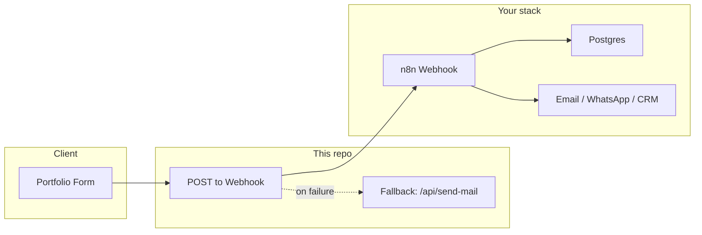
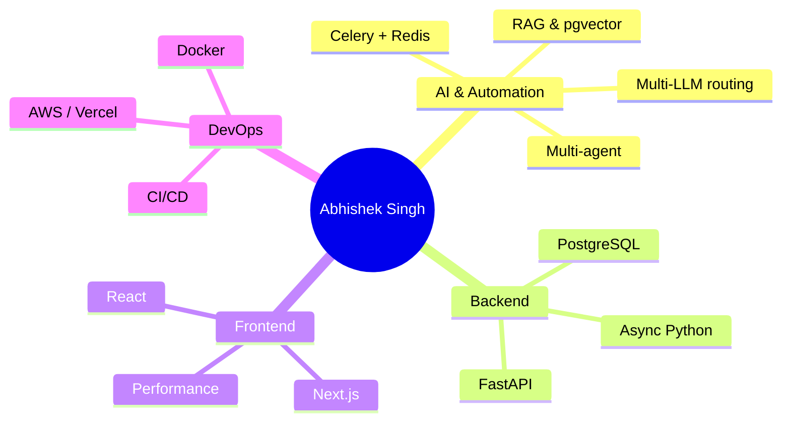

<div align="center">

  <!-- Banner: add your image at assets/readme-banner.png (e.g. 1200x320) -->
  

  <br />

  # **Abhishek Singh**

  ### AI Systems Engineer & Full-Stack Architect

  *Building intelligent automation, RAG, multi-agent systems & high-performance UIs*

  <br />

  <!-- Profile & repo -->
  [](https://github.com/abhishekthatguy)
  [](https://abhishekthatguy.in)
  [](https://linkedin.com/in/abhishekthatguy)
  [](./LICENSE)

  <br />

  <!-- Stack: AI & backend -->
  [](https://fastapi.tiangolo.com/)
  [](https://python.org)
  [](https://postgresql.org)
  [](https://redis.io)
  [](https://docs.celeryq.dev/)
  [](https://openai.com)

  <!-- Stack: Frontend & deploy -->
  [](https://nextjs.org/)
  [](https://react.dev/)
  [](https://www.typescriptlang.org/)
  [](https://tailwindcss.com/)
  [](https://vercel.com/)
  [](https://jestjs.io/)

</div>

---

## About

This repo is my **portfolio and brand site** — a performant, theme-aware single-page experience showcasing my work as an **AI Systems Engineer & Full-Stack Architect**. It highlights applied AI (multi-agent, RAG, LLM orchestration), backend systems (FastAPI, Celery, Redis, pgvector), and frontend architecture (Next.js, React, 90+ Lighthouse).

- **Live site:** [abhishekthatguy.in](https://abhishekthatguy.in)
- **More code:** [github.com/abhishekthatguy](https://github.com/abhishekthatguy) — this repo and other projects live on the same GitHub profile.

---

## Skills & Expertise

| Area | Focus |
|------|--------|
| **AI & automation** | Multi-agent systems, RAG, vector search (pgvector), prompt engineering, multi-LLM routing (Ollama, OpenAI, Gemini), Celery + Redis |
| **Backend** | FastAPI, PostgreSQL, pgvector, async Python, REST/GraphQL |
| **Frontend** | Next.js, React, TypeScript, performance (Core Web Vitals, 90+ Lighthouse), responsive UI |
| **DevOps & infra** | Docker, CI/CD, AWS, Vercel |

---

## Featured Projects

| Project | Description | Stack |
|---------|-------------|--------|
| **Zaytri** | Production AI automation platform — multi-agent orchestration, RAG (pgvector), Celery/Redis, multi-LLM routing | Next.js, FastAPI, Celery, Redis, PostgreSQL, pgvector, Ollama, OpenAI, Gemini |
| **Portfolio (this site)** | High-performance portfolio with theme-aware UI, contact webhook, Nodemailer fallback | Next.js 14, React, Tailwind, Framer Motion, Vercel |
| **Policy Advisor** | Insurance platform — Vue.js, GraphQL, 30–90% perf gains, 20+ broker channels | Vue, Vuex, Strapi, Ruby on Rails |
| **Accredo & Express Scripts** | Healthcare UI refactor — React, 85%+ test coverage, HIPAA, zero downtime | React, Jest, Context API, LaunchDarkly |

*Full project list and metrics are on the [live portfolio](https://abhishekthatguy.in#projects).*

---

## Repository

- **This codebase:** [github.com/abhishekthatguy/portfolio-2025](https://github.com/abhishekthatguy/portfolio-2025)
- **Other work:** [github.com/abhishekthatguy](https://github.com/abhishekthatguy) — all other repos (AI, full-stack, tools) are on the same GitHub profile.

---

## Architecture

Contact form flow (Portfolio → webhook → your backend):



Tech and role at a glance:



---

## Features

| Feature | Description |
|--------|-------------|
| **Animated UI** | Dual-tone headings, Framer Motion, dark/light theme |
| **Sections** | Hero, About, Achievements, Skills, Experience, Projects, Education, Contact |
| **Contact** | Form POSTs to n8n webhook; Nodemailer fallback if webhook fails |
| **Responsive** | Mobile-first, scales across devices |
| **Deploy** | Vercel one-command deploy, Git-triggered builds |
| **Tests** | Jest + React Testing Library |

---

## Quick Start

### Development

```bash
yarn install
yarn dev
```

Open [http://localhost:3000](http://localhost:3000) (or the port shown).

### Build & run

```bash
yarn build
yarn start
```

### Deploy to Vercel

```bash
yarn deploy          # Automated (recommended)
yarn deploy:quick    # Quick prod deploy
yarn deploy:local    # Local Vercel preview
```

---

## Tech Stack (this repo)

| Layer | Technologies |
|-------|--------------|
| **Frontend** | Next.js 14, React 18, Tailwind CSS 3, Framer Motion 12, PostCSS |
| **Contact** | n8n webhook (URL in `.env`) → Postgres / Email / WhatsApp / CRM; fallback: Nodemailer |
| **Testing** | Jest 29, React Testing Library |
| **Lint** | ESLint, eslint-config-next |
| **Hosting** | Vercel |

---

## Environment Variables

Configure in `.env` (see [.env.example](./.env.example)). Do not commit `.env`.

| Variable | Description |
|----------|-------------|
| `NEXT_PUBLIC_WEBHOOK_URL` | n8n webhook URL; contact form POSTs here first |
| `MAIL_SERVER`, `MAIL_PORT`, `MAIL_USERNAME`, `MAIL_PASSWORD` | SMTP for fallback when webhook fails (Nodemailer) |
| `RECIPIENT_EMAIL` | Inbox for fallback emails (defaults to `MAIL_USERNAME`) |

Flow details: [Architecture](./docs/ARCHITECTURE.md).

---

## Project Structure

```
├── assets/                 # README banner and static assets
│   └── readme-banner.png
├── docs/
│   └── ARCHITECTURE.md     # Contact flow (webhook → n8n → Postgres)
├── src/
│   ├── app/                # Next.js App Router (pages, layout)
│   ├── components/         # Hero, About, Skills, Projects, Contact, etc.
│   ├── data/               # projects, skills
│   ├── hooks/              # useTheme, useThemeStyles
│   ├── constants/          # techStack
│   └── styles/             # theme, animations
├── scripts/
├── vercel.json
└── package.json
```

---

## Documentation

| Guide | Description |
|-------|-------------|
| [Quick Start](./QUICK_START.md) | Get deployed in 15 minutes |
| [Vercel Deployment](./VERCEL_DEPLOYMENT_GUIDE.md) | Full setup and env vars |
| [Architecture](./docs/ARCHITECTURE.md) | Contact flow: Portfolio → Webhook (n8n) → Postgres → Email/WhatsApp/CRM |

---

## Links

- [Portfolio](https://abhishekthatguy.in)
- [GitHub profile](https://github.com/abhishekthatguy)
- [LinkedIn](https://linkedin.com/in/abhishekthatguy)
- [Next.js Docs](https://nextjs.org/docs)
- [Vercel Docs](https://vercel.com/docs)

---

<div align="center">

**© 2026 Abhishek Singh. All rights reserved.**

</div>
